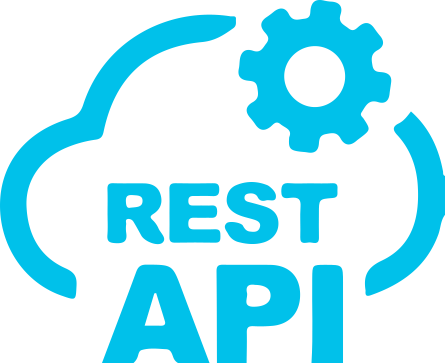

## Hi!

### I'm Sriram V,

&ensp;

- `Ruby on Rails` & `Vue.js` Developer
- Learning `Typescript`
- Having fun with `SVG` animations
- Currently working on my devfolio
- Checkout my other projects!

&ensp;

&ensp;

### Languages:

    &ensp;&ensp;&ensp;
     &ensp;&ensp;
     &ensp;&ensp;
     &ensp;&ensp;
     &ensp;&ensp;
    

&ensp;

    &ensp;&ensp;&ensp;&ensp;&ensp;&ensp;
     &ensp;&ensp;
     &ensp;&ensp;
     &ensp;&ensp;
    

### Frameworks & Libraries:

    &ensp;&ensp;&ensp;
     &ensp;&ensp;
     &ensp;&ensp;
     &ensp;&ensp;
     &ensp;&ensp;
    

&ensp;

    &ensp;&ensp;&ensp;&ensp;&ensp;
     &ensp;&ensp;
     &ensp;&ensp;
     &ensp;
    

### Backend services:

    &ensp;&ensp;&ensp;
     &ensp;&ensp;&ensp;
     &ensp;&ensp;&ensp;
    

&ensp;

    &ensp;&ensp;&ensp;&ensp;
     &ensp;&ensp;&ensp;
     &ensp;&ensp;&ensp;
     &ensp;&ensp;&ensp;
    

### Tools:

    &ensp;&ensp;&ensp;
     &ensp;&ensp;
    

&ensp;