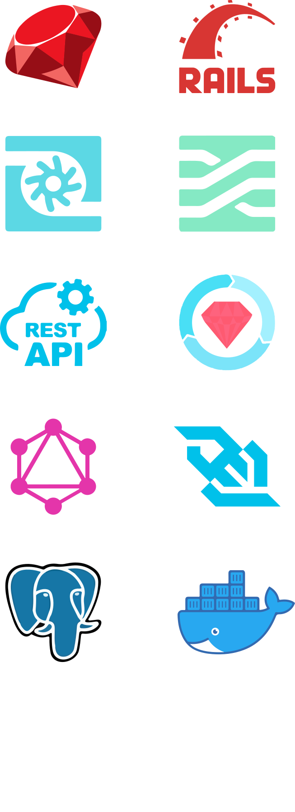
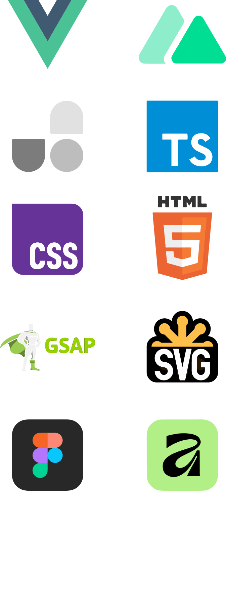

## Hi!

My name is <strong>Sriram V</strong>.  
A well-grounded <code>Rubyist</code> and a <code>Ruby on Rails</code> developer by profession.  
Using <code>Vue.js</code> and <code>Nuxt.js</code> to bring my hobby projects and designs to life.  
Live, love and code by <em>Object Oriented Design</em>.  
Captivated by <code>Elixir</code>.  
The rest is in my portfolio:  

<a target="_blank" href="https://srira.me">https://srira.me</a>

  

